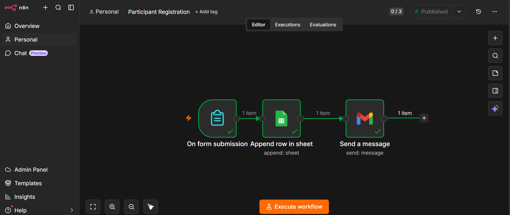
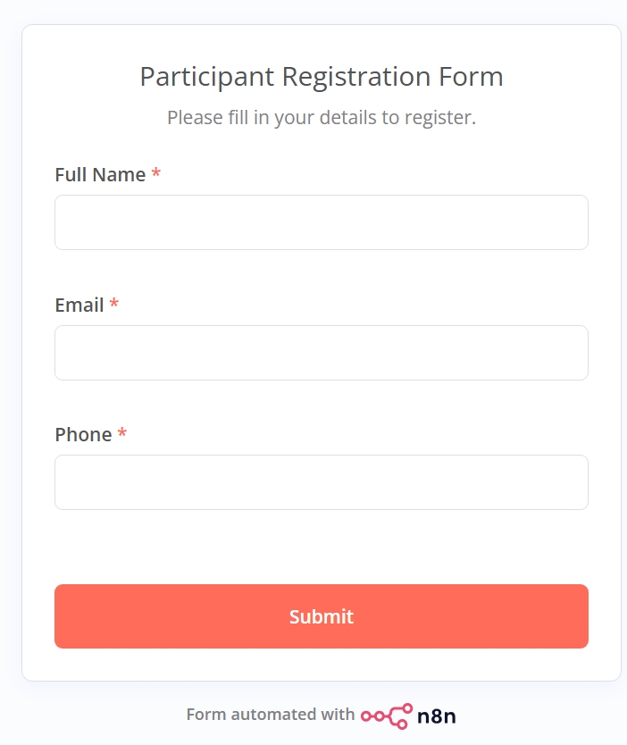
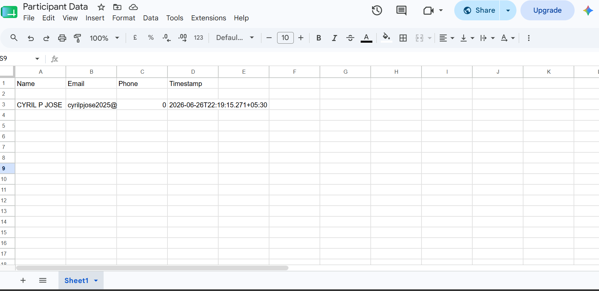
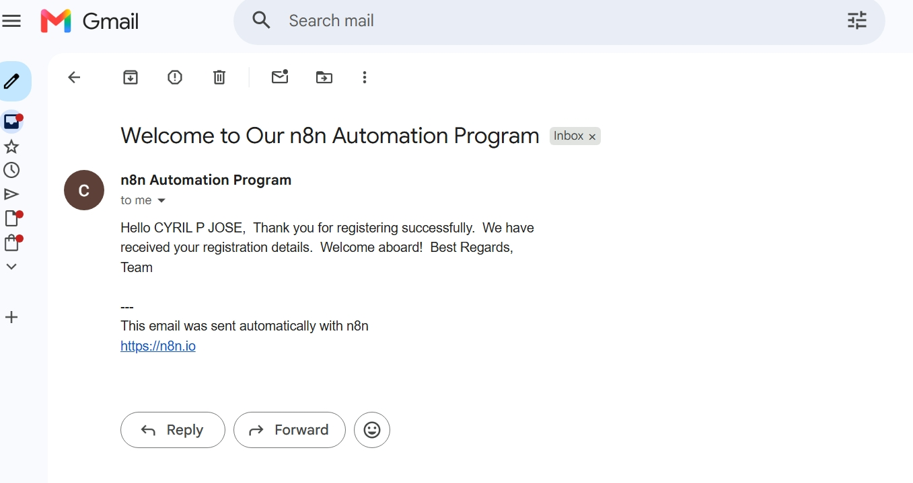

# 🚀 Participant Onboarding Automation using n8n


A no-code workflow automation project built using **n8n** that streamlines participant registration by collecting user details, storing them in Google Sheets, and automatically sending a welcome email.

---

## 🌐 Live Demo

📝 **Try the Registration Form**

**https://cyrilpjose.app.n8n.cloud/form/28292662-7609-4e01-b93a-69e4653698da**

> Submit the form with your email address to experience the complete automation workflow.

google sheet https://docs.google.com/spreadsheets/d/19gIQ7tl_P3fLy0RvESo32iWYseOnGVIhJOV_PAJdjB4/edit?gid=0#gid=0
---

# ✨ Features

- 📋 Registration Form using n8n Forms
- 📊 Automatic storage in Google Sheets
- 📧 Instant onboarding email via Gmail
- ⚡ Fully automated workflow
- ☁️ Cloud-hosted using n8n

---

# 🛠 Tech Stack

- n8n
- Google Sheets
- Gmail
- Workflow Automation
- No-Code / Low-Code

---

# ⚙ Workflow

```text
On Form Submission
        │
        ▼
Append Row in Google Sheets
        │
        ▼
Send Welcome Email
```

---

# 📷 Screenshots

## Workflow



---

## Registration Form



---

## Google Sheets



---

## Welcome Email




---


# 📁 Project Structure

```
n8n-Participant-Onboarding-Automation/
│
├── workflow.json
├── README.md
├── workflow.png
├── form.png
├── google-sheet.png
├── gmail.png
└── LICENSE
```

---

# 🚀 How It Works

1. User opens the registration form.
2. User submits Name, Email, and Phone.
3. n8n receives the submission.
4. The workflow appends the data to Google Sheets.
5. Gmail automatically sends a welcome email.
6. Workflow completes successfully.

---

# 📂 Exported Workflow

The complete n8n workflow is included as:

```
workflow.json
```

You can import it directly into your own n8n instance.

---

# 🎯 Future Improvements

- Email verification
- Duplicate registration detection
- WhatsApp notifications
- Slack integration
- Airtable support
- Discord notifications
- Welcome PDF generation
- Admin dashboard
- Participant analytics

---

# 💡 Learning Outcomes

Through this project, I learned:

- Building no-code automation workflows
- Connecting multiple cloud services
- Using Google Sheets as a lightweight database
- Automating email communication
- Designing end-to-end workflow automation using n8n

---

# 👨‍💻 Author

**Cyril P Jose**

GitHub: https://github.com/cyril-p-jose

LinkedIn: https://www.linkedin.com/in/cyril-p-jose/

⭐ If you found this project useful, consider giving it a star!
```

